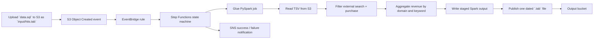

# Personal Notes

This file is a personal handoff note for the current state of the assignment.

It is not a marketing README.
It only documents:
- what is implemented
- what is not yet proven
- what the code currently does
- what the AWS flow is supposed to be
- what is still missing if the goal is a fully demonstrated submission

## End-To-End Flow

Sample file is `data.sql`; on AWS you upload it as `input/hits.tab`. Uploads under `input/` trigger the pipeline.



## Assignment Interpretation

The business question is:

How much revenue comes from external search engines, and which keywords perform best by revenue?

The current code interprets that as:
- include only external search referrers
- include only rows where event `1` exists in `event_list`
- count revenue from `product_list`
- group by search engine domain and keyword
- sort revenue descending
- write a tab-delimited output file named `YYYY-MM-DD_SearchKeywordPerformance.tab`

This interpretation is aligned with the PDF context because Appendix B states revenue is actualized only when the purchase event is set.

## What Is Implemented

### Local Python

- [local/cli.py](local/cli.py)
  - accepts a single file argument
  - runs local processing
  - writes the dated output file

- [local/processor.py](local/processor.py)
  - contains `SearchKeywordProcessor`
  - parses referrer domain
  - extracts search keyword from query params `q` and `p`
  - checks purchase event
  - parses product revenue
  - aggregates results
  - sorts revenue descending
  - writes required output headers

- [tests/test_processor.py](tests/test_processor.py)
  - unit tests for parsing, filtering, aggregation, and output naming

### AWS Runtime

- [glue/scripts/search_keyword_performance.py](glue/scripts/search_keyword_performance.py)
  - Glue PySpark job
  - contains `SearchKeywordGlueJob`
  - reads TSV from S3
  - filters external search + purchase event
  - calculates revenue
  - groups by domain and keyword
  - orders by revenue descending
  - writes temporary Spark output
  - copies one part file to the final required output key

### AWS Deployment

- [cdk/search_keyword_stack.py](cdk/search_keyword_stack.py)
  - creates input bucket
  - creates output bucket
  - creates SNS success and failure topics
  - uploads Glue script as a CDK asset
  - creates Glue job
  - creates Step Functions state machine
  - creates EventBridge rule for S3 object-created events on the input bucket

- [config/example_execution_input.json](config/example_execution_input.json)
  - example manual Step Functions input; replace `YOUR_INPUT_BUCKET` and `YOUR_OUTPUT_BUCKET` before use

## What The Code Flow Is Right Now

### Local Flow

1. Run:

```bash
python -m local data.sql
```

2. `local/cli.py` validates the file path.
3. `local/cli.py` creates `SearchKeywordProcessor`.
4. `local/processor.py` reads the TSV file.
5. Each row is checked for:
   - external search referrer
   - purchase event `1`
   - positive revenue
6. Matching rows are aggregated by:
   - search engine domain
   - search keyword
7. Output is sorted by revenue descending.
8. A dated `.tab` file is written locally.

### AWS Flow Intended By The Code

1. Deploy CDK stack.
2. CDK creates:
   - input S3 bucket
   - output S3 bucket
   - Glue job
   - Step Functions state machine
   - EventBridge rule
3. A file is uploaded to the input bucket under `input/`.
4. S3 emits an object-created event through EventBridge.
5. EventBridge starts the Step Functions state machine.
6. Step Functions resolves input/output paths.
   - manual execution input is supported
   - S3 event input is also supported
7. Step Functions starts the Glue job.
8. Glue reads the uploaded TSV from S3.
9. Glue processes data with PySpark.
10. Glue writes the final dated output file to the output bucket.
11. Step Functions publishes an SNS success or failure notification.

## What Was Verified Locally

Verified:
- unit tests pass
- local CLI runs
- Python files compile

Local verification results used:
- `pytest tests/ -v`
- `python3 -m local data.sql`
- `python3 -m py_compile local/processor.py local/cli.py local/__main__.py glue/scripts/search_keyword_performance.py cdk/search_keyword_stack.py`

## What Was Not Verified

Not verified in this environment:
- `cdk synth`
- `cdk deploy`
- actual AWS resource creation
- actual EventBridge trigger in AWS
- actual Step Functions execution in AWS
- actual Glue execution in AWS
- actual output written in AWS

Reason:
- this environment does not have the required AWS/CDK dependencies installed and no AWS deployment was run from here

## Current Sample Input Status

The sample file is [data.sql](data.sql). On AWS you upload it to the input bucket as `input/hits.tab`. It was updated so it now produces non-empty output for the business question.

Current local result:
- `google.com | ipod classic | 410.0`
- `bing.com | zune | 250.0`
- `search.yahoo.com | cd player | 180.0`

That means the sample file is now usable for a local walkthrough and a dry run explanation.

## What Is Missing For A Fully Demonstrated Submission

### Missing Proof

- actual AWS deployment proof
- actual end-to-end AWS run proof
- actual produced output file from AWS

### Missing Review Material

- short business summary of findings
- short scalability note tied to this specific implementation
- short explanation of tradeoffs and limitations

### Missing Demo Confidence

- a sample input that produces a non-empty output for the external-search revenue use case

## What Does Not Need To Be Added Unless You Want It

- more folders
- more infrastructure layers
- another processing implementation
- more local architecture for its own sake

The repo already has the essential pieces:
- processing logic
- tests
- Glue runtime
- CDK deployment
- event-driven orchestration design

## If You Want This To Be Truly Complete

The next concrete steps are:

1. Install CDK dependencies and run `cdk synth`.
2. Deploy to AWS.
3. Upload a file into the input bucket.
4. Confirm EventBridge starts Step Functions.
5. Confirm Step Functions starts Glue.
6. Confirm the output file appears in the output bucket.
7. Save the output and add a short findings section.

## Honest Status

Current status:
- technically implemented: mostly yes
- locally verified: yes
- AWS-proven: no
- review-ready for architecture discussion: yes
- review-ready for a full live end-to-end demo: not yet
