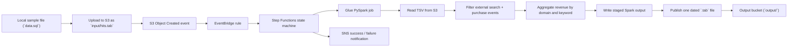

# Search Keyword Performance

This solution answers one business question: how much revenue comes from external search traffic, grouped by search engine and keyword.

The production path is AWS-first:

- an input file is uploaded to S3
- S3 triggers Step Functions through EventBridge
- Step Functions starts an AWS Glue PySpark job
- Glue processes the file and writes the final output to S3
- Step Functions sends an SNS notification for success or failure

The pipeline reads a tab-delimited hit-level file. The sample file in this repo is `data.sql`; when you run on AWS you upload it to the input bucket as `input/hits.tab`. Sample rows (lines 23–26) were added so that a run produces non-empty results: they have external-search referrers (Google, Bing, Yahoo), purchase event `1`, and positive revenue in `product_list`. The pipeline keeps rows where:

- the referrer is an external search engine
- the event list contains the purchase event
- the product list has positive revenue

It then aggregates revenue by `(search_engine_domain, search_keyword)` and writes:

`YYYY-MM-DD_SearchKeywordPerformance.tab`

## Architecture

AWS services used:

- Amazon S3
- Amazon EventBridge
- AWS Step Functions
- AWS Glue
- Amazon SNS
- AWS CDK

## End-To-End Flow

Uploads under `input/` in the input bucket trigger the pipeline automatically.




## What The Pipeline Produces

The final output is a tab-delimited file named:

`YYYY-MM-DD_SearchKeywordPerformance.tab`

The output columns are:

- Search Engine Domain
- Search Keyword
- Revenue

The rows are sorted by revenue in descending order.

## Canonical structure

This repo maintains one implementation path only:

```text
.
├── Data-Engineer_Applicant_Programming_Exercise.pdf
├── README.md
├── data.sql
├── local/
│   ├── __main__.py
│   ├── cli.py
│   └── processor.py
├── requirements.txt
├── config/
│   └── example_execution_input.json
├── glue/
│   └── scripts/
│       └── search_keyword_performance.py
├── cdk/
│   ├── app.py
│   ├── cdk.json
│   ├── requirements.txt
│   └── search_keyword_stack.py
└── tests/
    ├── test_processor.py
    └── test_glue_script.py
```

`cdk/` exists because this project uses AWS CDK for deployment.

## Repository Layout

- Core local business logic: `local/processor.py`
- Local CLI: `python -m local data.sql`
- Glue job: `glue/scripts/search_keyword_performance.py`
- AWS deployment and orchestration: `cdk/`
- Tests: `tests/test_processor.py`, `tests/test_glue_script.py`

## Prerequisites

- Python 3.10+
- Node 18+ (used by CDK)
- AWS CLI installed and configured (`aws configure` with your access key, secret, and default region)
- AWS credentials with permissions for CDK, S3, EventBridge, Step Functions, Glue, and SNS

Install local test dependencies from the repo root:

```bash
pip install -r requirements.txt
```

## Run Locally

Run the local-only version from the repo root:

```bash
python -m local data.sql
```

What happens locally:

1. `local/cli.py` validates the input path.
2. `local/processor.py` parses and filters the TSV.
3. Matching rows are aggregated by search engine and keyword.
4. A dated output file is written in the current working directory.

Local execution is only for development and verification. The intended runtime path for the assignment is AWS Glue.

## Run Tests

Tests are run **locally** on your machine (not in the AWS account). They do not require AWS credentials or a live deployment.

```bash
pytest tests/ -v
```

What the tests cover:

- local parser and aggregation behavior
- Glue helper logic that can be validated without running real AWS Glue

## Deploy To AWS

Install CDK dependencies and deploy from inside `cdk/`:

```bash
cd cdk
pip install -r requirements.txt
cdk bootstrap
cdk deploy
```

Save these outputs after deploy:

- `InputBucketName`
- `OutputBucketName`
- `StateMachineArn`
- `SuccessTopicArn`
- `FailureTopicArn`

If you want email notifications, create an SNS subscription for the success and failure topics after deployment.

## Execute The Pipeline

Upload the sample input (any file you put under `input/` in the input bucket will trigger the pipeline):

```bash
aws s3 cp data.sql s3://YOUR_INPUT_BUCKET/input/hits.tab
```

That upload starts the workflow automatically: S3 → EventBridge → Step Functions → Glue.

What happens in AWS:

1. The file lands in the input bucket under `input/`.
2. S3 emits an event to EventBridge (uploads under `input/` trigger the state machine).
3. EventBridge starts the Step Functions state machine.
4. Step Functions passes the input/output paths to the Glue job.
5. Glue reads the file from S3 and processes it with PySpark.
6. Glue publishes the final dated output file into the output bucket.
7. Step Functions sends an SNS message:
  - success: includes input path, output path, Glue job name, and Glue job run ID
  - failure: includes input path, output path, Step Functions error, and failure cause

The output is written to:

`s3://YOUR_OUTPUT_BUCKET/output/YYYY-MM-DD_SearchKeywordPerformance.tab`

**Idempotency:** If the job runs twice (e.g. duplicate S3 event or manual retry), it overwrites the same output path. The Glue job uses `mode("overwrite")` and the output key is fixed by date, so you get one result file per day with no duplicated rows.

You can also start the state machine manually. The payload looks like this:

```json
{
  "input_path": "s3://YOUR_INPUT_BUCKET/input/hits.tab",
  "output_path": "s3://YOUR_OUTPUT_BUCKET/output/"
}
```

We provide a template in `config/example_execution_input.json`. Edit that file and replace `YOUR_INPUT_BUCKET` and `YOUR_OUTPUT_BUCKET` with your actual bucket names, then run:

```bash
aws stepfunctions start-execution \
  --state-machine-arn <StateMachineArn> \
  --input file://config/example_execution_input.json
```


The AWS runtime path is designed for large files:

- Glue uses PySpark rather than plain Python file iteration
- the input is read from S3 directly
- aggregation is distributed across Spark workers
- the job now uses Glue version `5.1`

## Possible extensions

This pipeline could be extended by integrating with **OTF** (open table format) and writing results into analytics tables (e.g. in a data lake or warehouse). Analytics and data science teams could then query the same data directly (e.g. via Athena, Redshift, or Spark) without re-running the job for each analysis.

## Troubleshooting

- **CDK bootstrap**: You only need `cdk bootstrap` once per AWS account and region. If you already did it, you can skip it next time.
- **Where to look when something fails**: Check the Step Functions execution in the AWS console for the error message. If the failure is in the Glue job, open that run in the Glue console for logs and stack traces.

## Cleanup

```bash
cd cdk
cdk destroy
```

